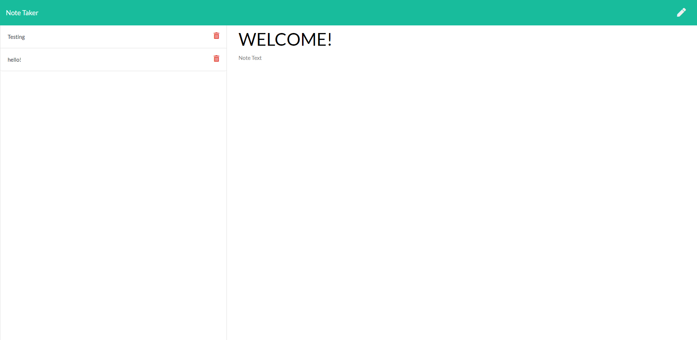

# note_pad

# Description

This is a Note application that stores user input into an express server.

## Table of Contents (Optional)


* [Installation](#installation)
* [Usage](#usage)
* [Credits](#credits)
* [License](#license)


## Installation

- Download this repo to your local machine.
- Once in the repo file in your terminal use "npm install" to make sure you have inquirer install.
- Next run "node server.js"
- input localhost:3000 into your web browser
- enjoy the application!


## Usage 

```
- JavaScript
- express
- Node.js
- uuid

```



## Credits
Credit to [Mike Fearnley](https://michaelfearnley.com/) and [Scott Byers](https://github.com/switch120)

and the UNH Fullstack Coding Bootcamp

## Links 

[deployed application](https://sheltered-ocean-94535.herokuapp.com/notes)

## Contact

if you want to contact me for any more questions here are my links!

hello@taylorgonz.com
\
[Website](http://www.taylorgonz.com)
\
[Linked in](https://www.linkedin.com/in/taylorgonz/)

## Licensing
This project is licensed by : 

[](https://lbesson.mit-license.org/) \
click the badge for more info